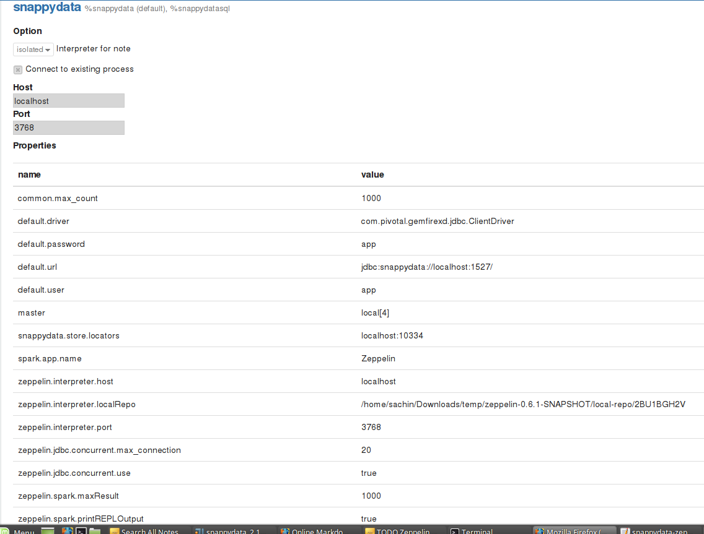

# zeppelin-interpreter
Snappydata interpreter for Apache Zeppelin

# Snappydata Interpreter for Apache Zeppelin

## Overview
[SnappyData](http://snappydatainc.github.io/snappydata/) is a distributed in-memory data store for real-time operational analytics, delivering stream analytics, OLTP (online transaction processing) and OLAP (online analytical processing) in a single integrated cluster. We realize this platform through a seamless integration of Apache Spark (as a big data computational engine) with GemFire XD (as an in-memory transactional store with scale-out SQL semantics).

## Installing and Running Snappydata Interpreter:
In order to use zeppelin with SnappyData following are the steps that needs to be performed:

1. Download latest snappydata binary and extract it
2. Copy snappydata zeppelin interpreter [jar](https://github.com/SnappyDataInc/zeppelin-interpreter/releases/download/v0.6/snappydata-zeppelin-0.6.jar) in the jars directory of snappydata
3. Enable snappydata zeppelin interpreter by setting **_zeppelin.interpreter.enable_** to true in lead node configuration
4. Start SnappyData cluster
Once snappydata cluster is being set up you have to connect to snappydata interpreter from zeppelin server.Following are the steps used to connect to remotely executing snappydata interpreter from zeppelin server:
1. Install snappydata interpreter in zeppelin by executing following command from zeppelin's bin directory
`./install-interpreter.sh --name snappydata --artifact io.snappydata:snappydata-zeppelin:0.6` 
2. Rename **zeppelin-site.xml.template** to **zeppelin-site.xml**
3. Add interpreter class names (**org.apache.zeppelin.interpreter.SnappyDataZeppelinInterpreter,org.apache.zeppelin.interpreter.SnappyDataSqlZeppelinInterpreter**) into **zeppelin.interpreters** property in configuration **zeppeline-site.xml**
4. Restart zeppelin server
5. Login to the zeppelin UI and browse for interpreter settings
6. Create and bind snappydata zeppelin by Clicking on  **+Create** button in the interpreter page, the interpreter drop-down list box will show all the available interpreters on your server.
7. Select **snappydata** interpreter from the dropdown and provide suitable name
8. Click on  **"Connect to existing process"** checkbox.It will enable 2 options to specfiy **host** and **port** for snappydata interpreter
9. Specify host on which snappydata **lead** node is executing along with the snappydata zeppelin port (Default: 3768)
10. Edit the other properties if needed.Following image shows snappydata interpreter properties:
  

## Supported properties and their values:
  First Header | Second Header | Description |
  ------------ | -------------| ------------ |
  default.driver  | JDBC Driver used to connect to snappydata | 
  snappydata.store.locators   | localhost:10334  | Used to specify locator URI (only **local/split** mode)|
  master | local`[*]` | Used to specify spark master URI (only **local/split** mode)|
  zeppelin.jdbc.concurrent.use | true | Used to specify which zeppelin scheduler should be used.True for Fair and False for FIFO |

## Using snappydata zeppelin interpreter:

  Snappydata Zeppelin Interpreter group consist of 2 interpreters:

  Interpreter Name | Description |
  ---------------- | ----------- |
  %snappydata.snappydata | This interpreter is used to write scala code on the paragraph.SnappyContext is injected in this interpreter and can be accessed using variable **_snc_**
  %snappydata.sql | This interpreter is used to execute sql queries on snappydata cluster. It also has features of executing Approximate queries on snappydata cluster.(Refer examples)

### Examples of Using Snappydata zeppelin Interpreter
